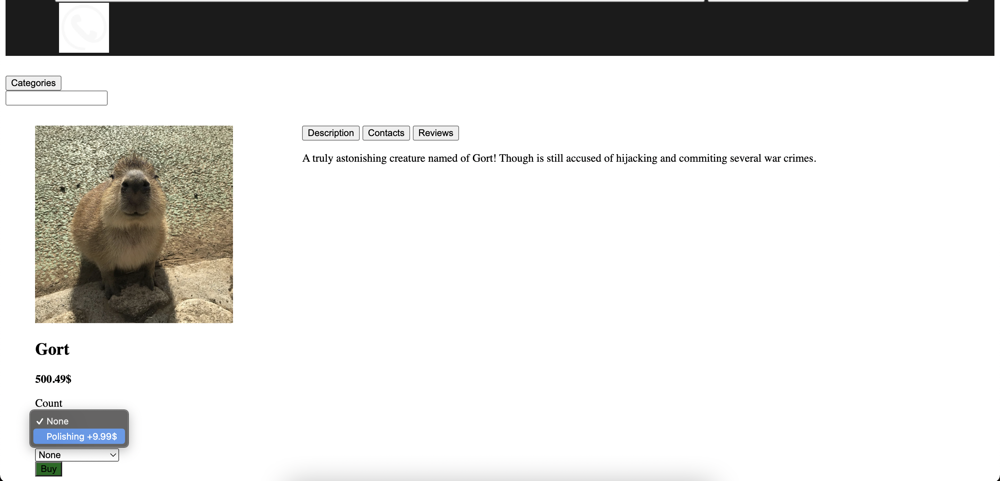
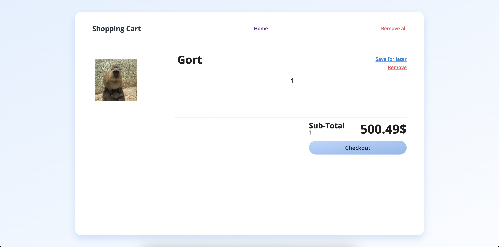
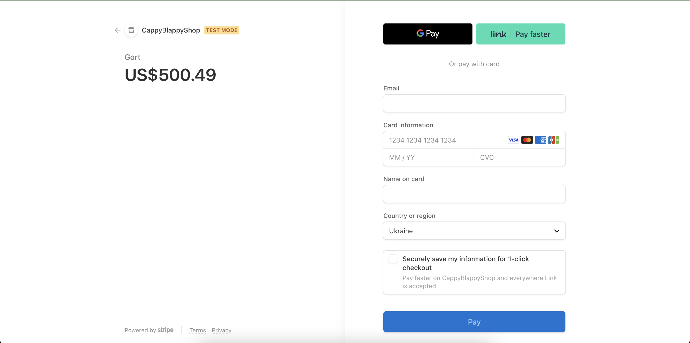
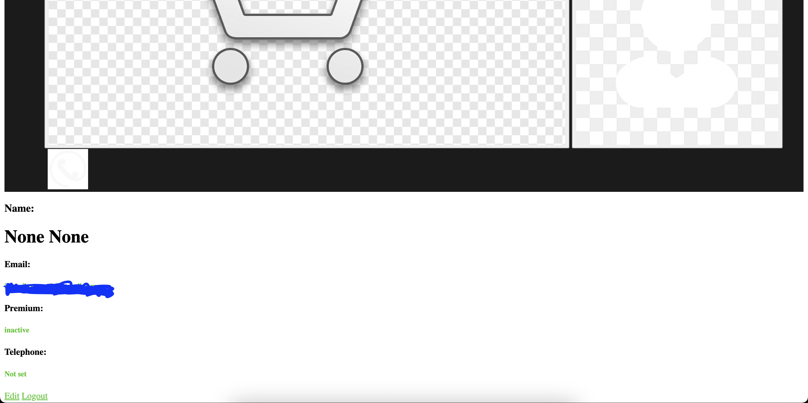

# CappyBlappyShop
### Table of contents:
- [Overview](#overview)
- [Looks](#looks)
- [What was implemented](#what-was-implemented)
- [What a user can do](#what-a-user-can-do)
- [.env file structure](#env-file-structure)
- [Running the project (Docker)](#running-the-project-with-docker-preferred-way)
- [Running the project (manually)](#running-the-project-manually)
- [Serving test data](#serving-test-data)
- [Test coverage stats](#test-coverage)
## Overview
! This repository represents only *webapp* part of the site! The *RESTful api* implementation is stored in RESTfulCappyBlappyShop (https://github.com/HCodeKeeper/RESTfulCappyBlappyShop) ! (it's separated as branching is a little messed up)\
This is a shop that sells capybaras. *Webapp* part is written in python and vanilla js, using django, redis, celery, mysql, stripe integration, nginx.

## Looks:
Catalogue

Product page

Cart

Checkout

Login

Profile


## What was implemented
- authorization: registration, login and password update. Using django mailing library and celery for sending authorization token asynchronously. The token is sent to your email and temporarily saved in redis to be compared with your input and then erased.
- page caching (django using redis)
- result pagination
- profile customizing
- cart (django session, redis)
- checkout and payment (stripe integration). The information about the purchased items is stored in the mysql database. The server is notified about succeeded purchase with webhooks.
## What a user can do
On this site you can:
- add to cart
- checkout your cart
- search products
- register
- update password
- login
- see random offers
- update profile info
- specify addons (services and additional products served by the seller) and quantity when adding a product in the cart


## .env file structure:
```dotenv
SERVER_PORT=8000
SERVER_IP=
DOMAIN=domain:${SERVER_PORT}
STRIPE_API_SECRET_KEY=
DB_USER=
DB_PASSWORD=
DB_HOST=
DB_PORT=
DJANGO_SECRET_KEY=key

EMAIL_HOST=smtp.gmail.com
EMAIL_PORT=587
EMAIL_HOST_USER=
EMAIL_HOST_PASSWORD=

TIME_ZONE=python_datetime_tz

#CACHE
CACHE_URL=redis://cache:num/num
#CELERY
CONFIG_BACKEND=redis://cache:num/num
CELERY_BROKER=redis://cache:num/num
```
## Running the project manually
run redis server
```
redis-server
```
run stripe listener
```
stripe listen --events checkout.session.completed --forward-to localhost:8000/event/checkout_succeeded/
```
run django server

## Running the project with Docker (preferred way)
####Prerequisites:
it is assumed you have docker or docker engine already installed on your host machine and this repository downloaded.
####Running:
Navigate towards the downloaded copy of this repository and run the code below. Or alternatively execute the same process in Docker GUI
```shell
docker compose up
```
This will run web server, reverse-proxy nginx server, redis, celery, database server and a stripe listener for writing orders to the database.

## Serving test data
If you want to make test records to application's database, you can load dev-demo.sql file in sql_dump_demo folder present in the repository to django dbshell.
Here is how you can do it with docker:
```shell
docker exec ${python web server container id} sh -c "cat sql_dump_demo/dev-demo.sql | python manage.py dbshell"
```
If you run the server locally, you can simply navigate to the application's folder containing manage.py and run this:
```shell
cat sql_dump_demo/dev-demo.sql | python manage.py dbshell
```

## Test coverage
```
# Generated with coverage.py

Name                                                                                    Stmts   Miss  Cover
-----------------------------------------------------------------------------------------------------------
accounts/__init__.py                                                                        0      0   100%
accounts/admin.py                                                                           1      1     0%
accounts/apps.py                                                                            4      4     0%
accounts/migrations/__init__.py                                                             0      0   100%
accounts/models.py                                                                          1      1     0%
accounts/tests.py                                                                           1      0   100%
accounts/urls.py                                                                            3      0   100%
accounts/views.py                                                                          31     18    42%
authentication/__init__.py                                                                  0      0   100%
authentication/admin.py                                                                     1      0   100%
authentication/apps.py                                                                      4      0   100%
authentication/migrations/__init__.py                                                       0      0   100%
authentication/models.py                                                                    1      0   100%
authentication/tasks.py                                                                    21     12    43%
authentication/tests.py                                                                     0      0   100%
authentication/urls.py                                                                      3      0   100%
authentication/views.py                                                                   112     84    25%
cappy_blappy_shop/__init__.py                                                               2      0   100%
cappy_blappy_shop/asgi.py                                                                   4      4     0%
cappy_blappy_shop/celery.py                                                                 7      0   100%
cappy_blappy_shop/settings.py                                                              45      0   100%
cappy_blappy_shop/urls.py                                                                   3      0   100%
cappy_blappy_shop/wsgi.py                                                                   4      4     0%
cart/__init__.py                                                                            0      0   100%
cart/admin.py                                                                               1      1     0%
cart/api.py                                                                                31     24    23%
cart/apps.py                                                                                4      4     0%
cart/migrations/__init__.py                                                                 0      0   100%
cart/models.py                                                                              1      1     0%
cart/tests.py                                                                               1      0   100%
cart/urls.py                                                                                3      0   100%
cart/views.py                                                                               7      3    57%
checkout/__init__.py                                                                        0      0   100%
checkout/admin.py                                                                           1      1     0%
checkout/api.py                                                                            19     11    42%
checkout/apps.py                                                                            4      4     0%
checkout/migrations/__init__.py                                                             0      0   100%
checkout/models.py                                                                          1      1     0%
checkout/tests.py                                                                           1      0   100%
checkout/urls.py                                                                            3      0   100%
checkout/views.py                                                                           9      4    56%
custom_exceptions/__init__.py                                                               0      0   100%
custom_exceptions/account.py                                                                5      2    60%
custom_exceptions/cart.py                                                                   7      7     0%
custom_exceptions/session.py                                                                5      2    60%
events/__init__.py                                                                          0      0   100%
events/admin.py                                                                             1      1     0%
events/api.py                                                                              30     19    37%
events/apps.py                                                                              4      4     0%
events/migrations/__init__.py                                                               0      0   100%
events/models.py                                                                            1      1     0%
events/tests.py                                                                             1      0   100%
events/urls.py                                                                              3      0   100%
events/views.py                                                                             2      0   100%
helpers/__init__.py                                                                         0      0   100%
helpers/account.py                                                                         11      2    82%
helpers/ajax.py                                                                            15      1    93%
helpers/checkout.py                                                                        31     20    35%
helpers/datetime_utils.py                                                                   8      5    38%
helpers/responsibilit_chain.py                                                             13      7    46%
helpers/validators.py                                                                      13     11    15%
manage.py                                                                                  12      2    83%
services/__init__.py                                                                        0      0   100%
services/account.py                                                                        91     61    33%
services/cart_service.py                                                                   59     34    42%
services/category_service.py                                                                7      5    29%
services/deal_service.py                                                                   28      3    89%
services/mailing.py                                                                         8      4    50%
services/order_service.py                                                                  56     40    29%
services/product_service.py                                                                54      2    96%
services/reviews.py                                                                        29     20    31%
services/session.py                                                                        59     33    44%
services/user.py                                                                            9      6    33%
shop/__init__.py                                                                            0      0   100%
shop/admin.py                                                                               6      0   100%
shop/api.py                                                                                17      3    82%
shop/apps.py                                                                                4      0   100%
shop/migrations/0001_initial.py                                                             6      0   100%
shop/migrations/0002_alter_deal_product.py                                                  5      0   100%
shop/migrations/0003_rename_item_orderitem.py                                               4      0   100%
shop/migrations/0004_order_email_alter_order_customer.py                                    5      0   100%
shop/migrations/0005_order_price.py                                                         4      0   100%
shop/migrations/0006_rename_price_orderitem_unit_price.py                                   4      0   100%
shop/migrations/0007_alter_orderitem_addon.py                                               5      0   100%
shop/migrations/0008_telephone_alter_order_customer_alter_review_author_and_more.py         6      0   100%
shop/migrations/0009_alter_telephone_user.py                                                6      0   100%
shop/migrations/0010_alter_telephone_number.py                                              4      0   100%
shop/migrations/__init__.py                                                                 0      0   100%
shop/models.py                                                                             61      9    85%
shop/tests.py                                                                             119      0   100%
shop/urls.py                                                                                3      0   100%
shop/views.py                                                                              28      2    93%
user_profiles/__init__.py                                                                   0      0   100%
user_profiles/admin.py                                                                      1      0   100%
user_profiles/apps.py                                                                       4      0   100%
user_profiles/migrations/0001_initial.py                                                    7      0   100%
user_profiles/migrations/0002_alter_profile_email_alter_profile_telephone_and_more.py       6      0   100%
user_profiles/migrations/0003_alter_profile_telephone_alter_profile_user.py                 6      0   100%
user_profiles/migrations/0004_alter_profile_first_name_alter_profile_second_name.py         4      0   100%
user_profiles/migrations/__init__.py                                                        0      0   100%
user_profiles/models.py                                                                    12      1    92%
user_profiles/tests.py                                                                      1      0   100%
user_profiles/views.py                                                                      1      1     0%
-----------------------------------------------------------------------------------------------------------
TOTAL                                                                                    1225    490    60%

```