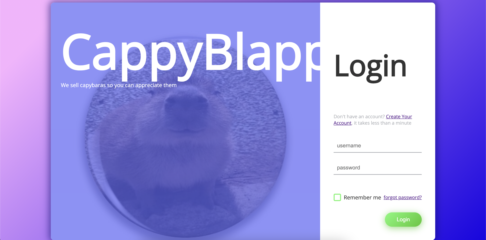

# CappyBlappyShop
## Overview
! This repository represents only *webapp* part of the site! The *RESTful api* implementation is stored in RESTfulCappyBlappyShop (https://github.com/HCodeKeeper/RESTfulCappyBlappyShop) ! (it's separated as branching is a little messed up)\
This is a shop that sells capybaras. *Webapp* part is written in python and vanilla js, using django, redis, celery, mysql, stripe integration.

## Looks:
Catalogue

Product page

Cart

Checkout

Login

Profile


## What was implemented
- authorization: registration, login and password update. Using django mailing library and celery for sending authorization token asynchronously. The token is sent to your email and temporarily saved in redis to be compared with your input and then erased.
- page caching (django using redis)
- result pagination
- profile customizing
- cart (django session, redis)
- checkout and payment (stripe integration). The information about the purchased items is stored in the mysql database. The server is notified about succeeded purchase with webhooks.
## What a user can do
On this site you can:
- add to cart
- checkout your cart
- search products
- register
- update password
- login
- see random offers
- update profile info
- specify addons (services and additional products served by the seller) and quantity when adding a product in the cart


## .env file structure:
```
SERVER_PORT=8000
DOMAIN=http://www.localhost:${SERVER_PORT}
STRIPE_API_SECRET_KEY=
DB_USER=
DB_PASSWORD=
DJANGO_SECRET_KEY=

EMAIL_HOST=smtp.gmail.com
EMAIL_PORT=587
EMAIL_HOST_USER=
EMAIL_HOST_PASSWORD=

TIME_ZONE=

#CELERY
CONFIG_BACKEND=redis://127.0.0.1:6379/3
CELERY_BROKER=redis://127.0.0.1:6379/2
```
## Running the project
run redis server
```
redis-server
```
run stripe listener
```
stripe listen --events checkout.session.completed --forward-to localhost:8000/event/checkout_succeeded/
```
run django server
